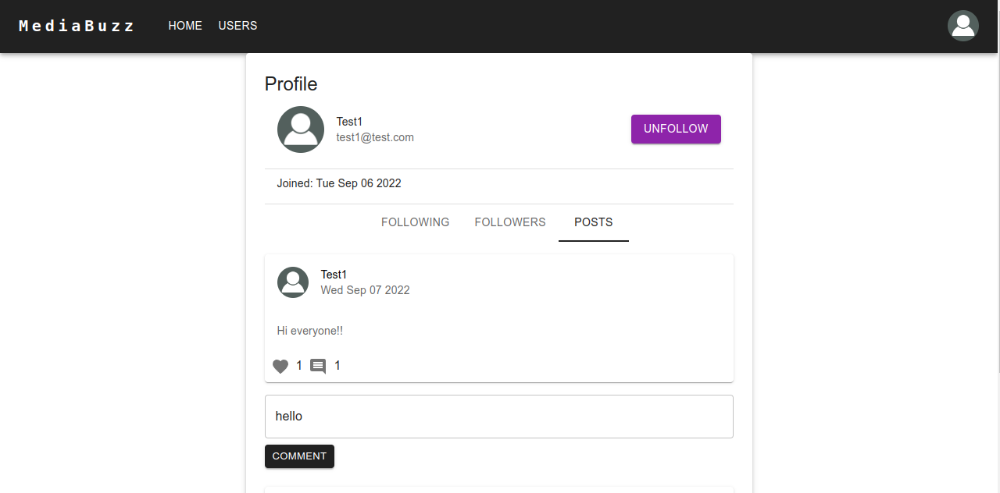
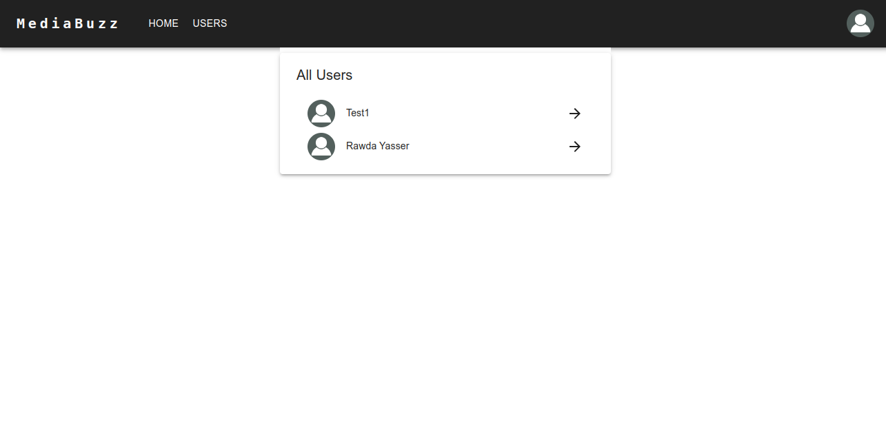

<h3 align="center">Media Buzz</h3>

<div align="center">

[](https://github.com/rawda-developer/Media-Buzz/issues)
[](https://github.com/rawda-developer/Media-Buzz/pulls)
[](/LICENSE)

</div>

---

<p align="center"> 
Media Buzz is a social media application inspired by existing social media platforms such as Facebook and Twitter <br> 
</p>

## 📝 Table of Contents

- [About](#about)
- [Getting Started](#getting_started)
- [Usage](#usage)
- [Built Using](#built_using)
- [Authors](#authors)
## Images



## Features

### Done

- User Authentication and authorization using JWT and Express.js middleware
- User can add/update/delete their profile information
- Users can follow each other
- Recommendation to follow other people
- Listing posts by user
- Creating a post with photos
- Newsfeed with posts from followed users
- Users can like posts from other users or their own posts
- Users can add a comment on any post in the system

## 🏁 Getting Started <a name = "getting_started"></a>

### Prerequisites

```
node -v
npm -v
```

### Installing

1. Clone the project

```
git clone https://github.com/rawdaymohamed/Media-Buzz
cd Media-Buzz
```

2. Run the Backend

```
sudo mongod --port 27017
```

- Open a new terminal

```
cd backend
npm i
npm run dev
```

3. Run the frontend

- Open a new terminal

```
cd frontend
npm i
npm start
```

## 🎈 Usage <a name="usage"></a>

Use this project as a guideline for building your next full stack website using MERN stack and Material UI.

## ⛏️ Built Using <a name = "built_using"></a>

- [MongoDB](https://www.mongodb.com/) - Database
- [Express](https://expressjs.com/) - Server Framework
- [ReactJs](https://reactjs.org/) - Web Framework
- [NodeJs](https://nodejs.org/en/) - Server Environment

## ✍️ Authors <a name = "authors"></a>

- [@RawdaYasser](https://github.com/rawdaymohamed/) - Idea & Initial work
